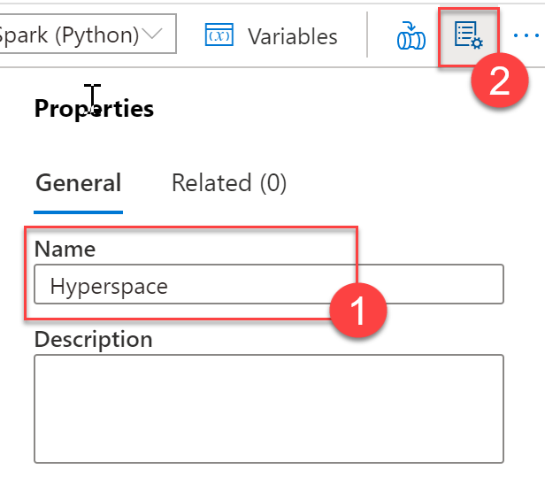
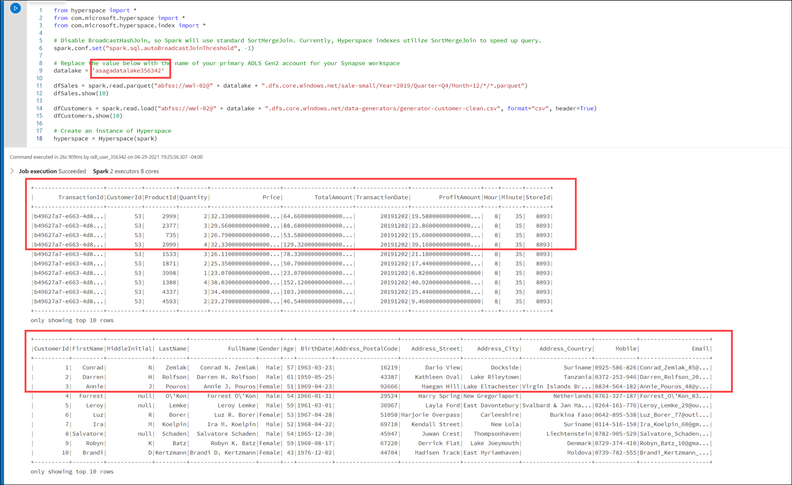
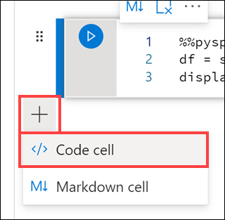
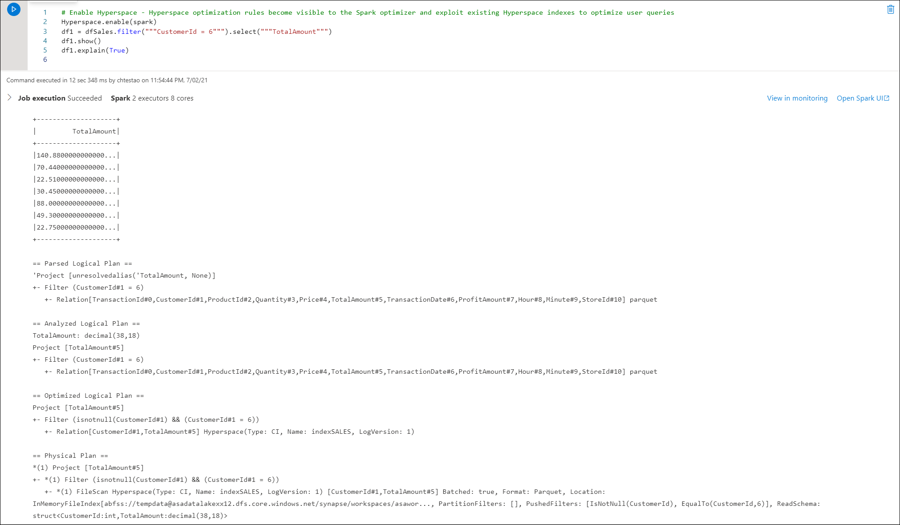

---
lab:
    title: 'Explore compute and storage options for data engineering workloads'
    module: 'Module 1'
---

# Module 1 - Explore compute and storage options for data engineering workloads

This module teaches ways to structure the data lake, and to optimize the files for exploration, streaming, and batch workloads. The student will learn how to organize the data lake into levels of data refinement as they transform files through batch and stream processing. Then they will learn how to create indexes on their datasets, such as CSV, JSON, and Parquet files, and use them for potential query and workload acceleration.

In this module, the student will be able to:

- Combine streaming and batch processing with a single pipeline
- Organize the data lake into levels of file transformation
- Index data lake storage for query and workload acceleration

## Lab details

- [Module 1 - Explore compute and storage options for data engineering workloads](#module-1---explore-compute-and-storage-options-for-data-engineering-workloads)
  - [Lab details](#lab-details)
  - [Lab 1 - Delta Lake architecture](#lab-1---delta-lake-architecture)
    - [Exercise 1: Complete the lab notebook](#exercise-1-complete-the-lab-notebook)
      - [Task 1: Clone the Databricks archive](#task-1-clone-the-databricks-archive)
      - [Task 2: Complete the following notebook](#task-2-complete-the-following-notebook)
  - [Lab 2 - Working with Apache Spark in Synapse Analytics](#lab-2---working-with-apache-spark-in-synapse-analytics)
      - [Task 1: Index the Data Lake storage with Hyperspace](#task-1-index-the-data-lake-storage-with-hyperspace)
      - [Task 2: Explore the Data Lake storage with the MSSparkUtil library](#task-2-explore-the-data-lake-storage-with-the-mssparkutil-library)
    - [Resources](#resources)

## Lab 1 - Delta Lake architecture

In this lab, you will use an Azure Databricks workspace and perform Structured Streaming with batch jobs by using Delta Lake. You need to complete the exercises within a Databricks Notebook. To begin, you need to have access to an Azure Databricks workspace.

### Exercise 1: Complete the lab notebook

#### Task 1: Create an Azure Databricks cluster

1. In the Azure portal, navigate to the Azure resource group created by the setup script for this course, then select the Azure Databricks workspace.

    

2. Select **Launch Workspace** to open your Databricks workspace in a new tab.

    

3. In the left-hand menu of your Databricks workspace, select **Compute**.
4. Select **Create Cluster** to add a new cluster.

    

5. Enter a name for your cluster, such as `Test Cluster`.
6. Select the **Databricks RuntimeVersion**. We recommend the latest runtime and **Scala 2.12**.
7. Select the default values for the cluster configuration.
8. Check **Spot instances** to optimize costs.
9. Select **Create Cluster**.
10. Wait for the cluster to start. Please note you will have to wait 5 - 7 minutes for the cluster to start up before moving onto the next task.

#### Task 2: Clone the Databricks archive

1. In the Azure Databricks Workspace, in the left pane, select **Workspace** > **Users**, and select your username (the entry with the house icon).
1. In the pane that appears, select the arrow next to your name, and select **Import**.

    

1. In the **Import Notebooks** dialog box, select the URL and paste in the following URL: <!-- Update path when lab files move to MicrosoftLearning repo -->

    ```
    https://github.com/ctesta-oneillmsft/xyz/blob/main/Allfiles/microsoft-learning-paths-databricks-notebooks/data-engineering/DBC/11-Delta-Lake-Architecture.dbc?raw=true
    ```

1. Select **Import**.
1. Select the **11-Delta-Lake-Architecture** folder that appears.
1. To enable you to see files being created in the notebook, click the **user name** in upper right hand corner of the Databricks workspace, and then click **Admin Console**
1. In the Admin console screen, click **Workspace Settings**.
1. In Advanced section, click **enable DBFS File Viewer**.
1. In the left pane, select **Workspace** > **Users**, and select your username (the entry with the house icon), and click on the **11-Delta-Lake-Architecture** folder.

#### Task 2: Complete the following notebook

1. Open the **1-Delta-Architecture** notebook. Make sure you attach your cluster to the notebook before following the instructions and running the cells within.Within the notebook, you will explore combining streaming and batch processing with a single pipeline.

    > After you've completed the notebook, return to this screen, and continue to the next lab.

1. In the left pane, select **Compute** and click on **Test cluster**. Click on **Terminate** to stop the cluster.

## Lab 2 - Working with Apache Spark in Synapse Analytics

This lab demonstrates the experience of working with Apache Spark in Azure Synapse Analytics. You will also learn how to use libraries like Hyperspace and MSSparkUtil to optimize the experience of working with Data Lake storage accounts from Spark notebooks.

After completing the lab, you will understand how to load and make use of Spark libraries in an Azure Synapse Analytics workspace.
#### Task 1: Index the Data Lake storage with Hyperspace

When loading data from Azure Data Lake Gen 2, searching in the data is one of the most resource consuming operations. [Hyperspace](https://github.com/microsoft/hyperspace) introduces the ability for Apache Spark users to create indexes on their datasets, such as CSV, JSON, and Parquet, and use them for potential query and workload acceleration.

Hyperspace lets you create indexes on records scanned from persisted data files. After they're successfully created, an entry that corresponds to the index is added to the Hyperspace's metadata. This metadata is later used by Apache Spark's optimizer during query processing to find and use proper indexes. If the underlying data changes, you can refresh an existing index to capture that.

Also, Hyperspace allows users to compare their original plan versus the updated index-dependent plan before running their query.

1. Open Synapse Studio (<https://web.azuresynapse.net/>).

2. Select the **Develop** hub.

    

3. Select **+**, then **Notebook** to create a new Synapse notebook.

    

4. Enter **Hyperspace** for the notebook name **(1)**, then select the **Properties** button above **(2)** to hide the properties pane.

    

5. Attach the notebook to the Spark cluster and make sure that the language is set to **PySpark (Python)**.

    

6. Add the following code to a new cell in your notebook:

    ```python
    from hyperspace import *  
    from com.microsoft.hyperspace import *
    from com.microsoft.hyperspace.index import *

    # Disable BroadcastHashJoin, so Spark will use standard SortMergeJoin. Currently, Hyperspace indexes utilize SortMergeJoin to speed up query.
    spark.conf.set("spark.sql.autoBroadcastJoinThreshold", -1)

    # Replace the value below with the name of your primary ADLS Gen2 account for your Synapse workspace
    datalake = 'REPLACE_WITH_YOUR_DATALAKE_NAME'

    dfSales = spark.read.parquet("abfss://wwi-02@" + datalake + ".dfs.core.windows.net/sale-small/Year=2019/Quarter=Q4/Month=12/*/*.parquet")
    dfSales.show(10)

    dfCustomers = spark.read.load("abfss://wwi-02@" + datalake + ".dfs.core.windows.net/data-generators/generator-customer-clean.csv", format="csv", header=True)
    dfCustomers.show(10)

    # Create an instance of Hyperspace
    hyperspace = Hyperspace(spark)
    ```

    Replace the `REPLACE_WITH_YOUR_DATALAKE_NAME` value with the name of your primary ADLS Gen2 account for your Synapse workspace. To find this, do the following:

    1. Navigate to the **Data** hub.

        

    2. Select the **Linked** tab **(1)**, expand the Azure Data Lake Storage Gen2 group, then make note of the primary ADLS Gen2 name **(2)** next to the name of the workspace.

        

7. Run the new cell. It will load the two DataFrames with data from the data lake and initialize Hyperspace.

    

    > **Note**: You may select the Run button to the left of the cell, or enter `Shift+Enter` to execute the cell and create a new cell below.
    >
    > The first time you execute a cell in the notebook will take a few minutes since it must start a new Spark cluster. Each subsequent cell execution should be must faster.

8. Select the **+** button beneath the cell output, then select **</> Code cell** to create a new code cell beneath.

    

9. Paste the following code into the new cell:

    ```python
    #create indexes: each one contains a name, a set of indexed columns and a set of included columns
    indexConfigSales = IndexConfig("indexSALES", ["CustomerId"], ["TotalAmount"])
    indexConfigCustomers = IndexConfig("indexCUSTOMERS", ["CustomerId"], ["FullName"])

    hyperspace.createIndex(dfSales, indexConfigSales)			# only create index once
    hyperspace.createIndex(dfCustomers, indexConfigCustomers)	# only create index once
    hyperspace.indexes().show()
    ```

10. Run the new cell. It will create two indexes and display their structure.

    

11. Add another new code cell to your notebook with the following code:

    ```python
    df1 = dfSales.filter("""CustomerId = 6""").select("""TotalAmount""")
    df1.show()
    df1.explain(True)
    ```

12. Run the new cell. The output will show that the physical execution plan is not taking into account any of the indexes (performs a file scan on the original data file).

    

13. Now add another new cell to your notebook with the following code (notice the extra line at the beginning used to enable Hyperspace optimization in the Spark engine):

    ```python
    # Enable Hyperspace - Hyperspace optimization rules become visible to the Spark optimizer and exploit existing Hyperspace indexes to optimize user queries
    Hyperspace.enable(spark)
    df1 = dfSales.filter("""CustomerId = 6""").select("""TotalAmount""")
    df1.show()
    df1.explain(True)
    ```

14. Run the new cell. The output will show that the physical execution plan is now using the index instead of the original data file.

    

15. Hyperspace provides an Explain API that allows you to compare the execution plans without indexes vs. with indexes. Add a new cell with the following code:

    ```python
    df1 = dfSales.filter("""CustomerId = 6""").select("""TotalAmount""")

    spark.conf.set("spark.hyperspace.explain.displayMode", "html")
    hyperspace.explain(df1, True, displayHTML)
    ```

16. Run the new cell. The output shows a comparison `Plan with indexes` vs. `Plan without indexes`. Observe how, in the first case the index file is used while in the second case the original data file is used.

    

17. Let's investigate now a more complex case, involving a join operation. Add a new cell with the following code:

    ```python
    eqJoin = dfSales.join(dfCustomers, dfSales.CustomerId == dfCustomers.CustomerId).select(dfSales.TotalAmount, dfCustomers.FullName)

    hyperspace.explain(eqJoin, True, displayHTML)
    ```

18. Run the new cell. The output shows again a comparison `Plan with indexes` vs. `Plan without indexes`, where indexes are used in the first case and the original data files in the second.

    

    In case you want to deactivate Hyperspace and cleanup the indexes, you can run the following code:

    ```python
    # Disable Hyperspace - Hyperspace rules no longer apply during query optimization. Disabling Hyperspace has no impact on created indexes because they remain intact
    Hyperspace.disable(spark)

    hyperspace.deleteIndex("indexSALES")
    hyperspace.vacuumIndex("indexSALES")
    hyperspace.deleteIndex("indexCUSTOMERS")
    hyperspace.vacuumIndex("indexCUSTOMERS")
    ```

#### Task 2: Explore the Data Lake storage with the MSSparkUtil library

Microsoft Spark Utilities (MSSparkUtils) is a builtin package to help you easily perform common tasks. You can use MSSparkUtils to work with file systems, to get environment variables, and to work with secrets.

1. Continue with the same notebook from the previous task and add a new cell with the following code:

    ```python
    from notebookutils import mssparkutils

    #
    # Microsoft Spark Utilities
    #
    # https://docs.microsoft.com/en-us/azure/synapse-analytics/spark/microsoft-spark-utilities?pivots=programming-language-python
    #

    # Azure storage access info
    blob_account_name = datalake
    blob_container_name = 'wwi-02'
    blob_relative_path = '/'
    linkedServiceName = datalake
    blob_sas_token = mssparkutils.credentials.getConnectionStringOrCreds(linkedServiceName)

    # Allow SPARK to access from Blob remotely
    spark.conf.set('fs.azure.sas.%s.%s.blob.core.windows.net' % (blob_container_name, blob_account_name), blob_sas_token)

    files = mssparkutils.fs.ls('/')
    for file in files:
        print(file.name, file.isDir, file.isFile, file.path, file.size)

    mssparkutils.fs.mkdirs('/SomeNewFolder')

    files = mssparkutils.fs.ls('/')
    for file in files:
        print(file.name, file.isDir, file.isFile, file.path, file.size)
    ```

2. Run the new cell and observe how `mssparkutils` is used to work with the file system.

### Resources

To learn more about the topics covered in this lab, use these resources:

- [Apache Spark in Azure Synapse Analytics](https://docs.microsoft.com/azure/synapse-analytics/spark/apache-spark-overview)
- [Announcing Azure Data Explorer data connector for Azure Synapse](https://techcommunity.microsoft.com/t5/azure-data-explorer/announcing-azure-data-explorer-data-connector-for-azure-synapse/ba-p/1743868)
- [Connect to Azure Data Explorer using Apache Spark for Azure Synapse Analytics](https://docs.microsoft.com/azure/synapse-analytics/quickstart-connect-azure-data-explorer)
- [Azure Synapse Analytics shared metadata](https://docs.microsoft.com/azure/synapse-analytics/metadata/overview)
- [Introduction of Microsoft Spark Utilities](https://docs.microsoft.com/azure/synapse-analytics/spark/microsoft-spark-utilities?pivots=programming-language-python)
- [Hyperspace - An open source indexing subsystem that brings index-based query acceleration to Apache Spark™ and big data workloads](https://github.com/microsoft/hyperspace)
