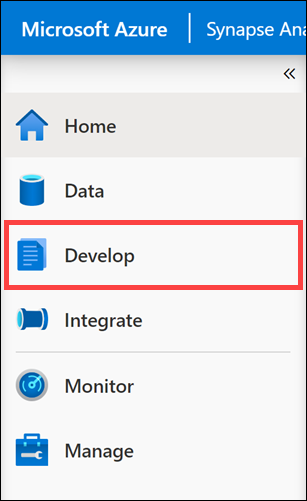
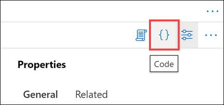
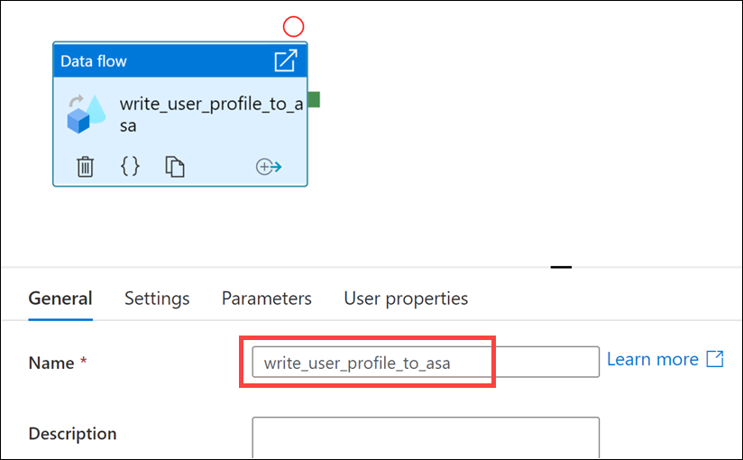
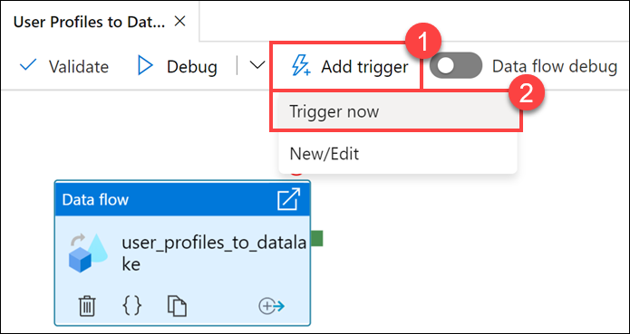
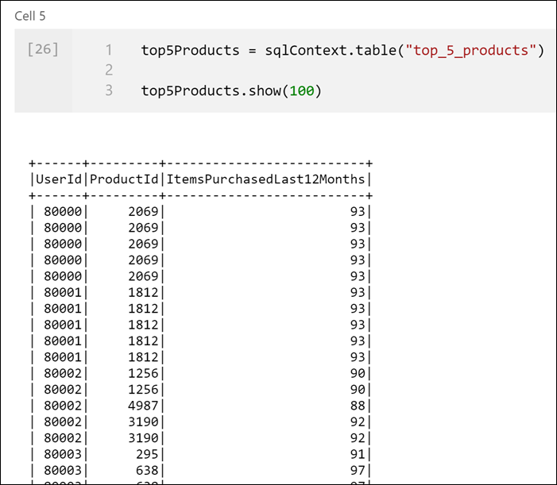
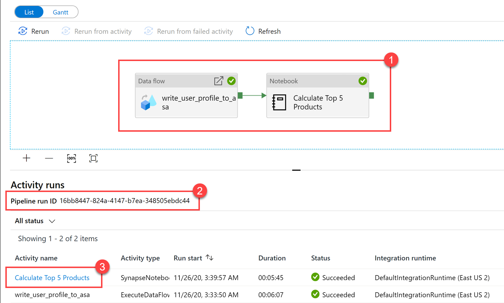
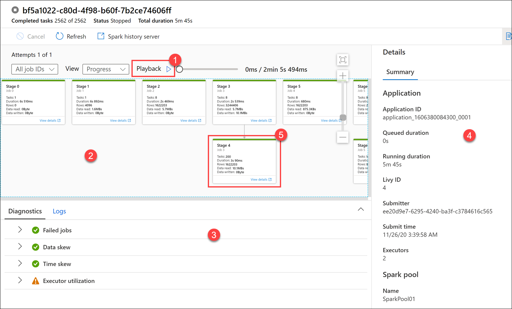
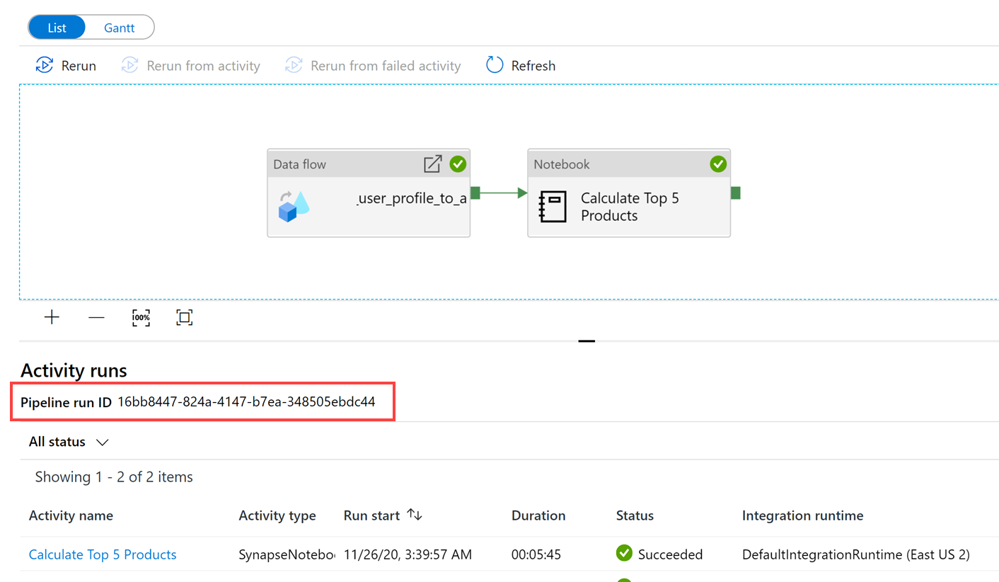

---
lab:
    title: 'Integrate data from notebooks with Azure Data Factory or Azure Synapse Pipelines'
    module: 'Module 7'
---

# Lab 7 - Integrate data from notebooks with Azure Data Factory or Azure Synapse Pipelines

You will learn how to create linked services, and orchestrate data movement and transformation in Azure Synapse Pipelines.

After completing this lab, you will be able to:

- Orchestrate data movement and transformation in Azure Synapse Pipelines

## Lab details

- [Lab setup and pre-requisites](#Lab-setup-and-pre-requisites)
- [Exercise 1 - Create mapping data flow and pipeline](#Exercise-1---Create-mapping-data-flow-and-pipeline)
- [Exercise 2 - Create Synapse Spark notebook to find top products](#Exercise-2---Create-Synapse-Spark-notebook-to-find-top-products)

## Lab setup and pre-requisites

Before starting this lab, you should complete **Lab 6: *Transform data with Azure Data Factory or Azure Synapse Pipelines***.

> **Note**: If you have ***not*** completed lab 6, but you <u>have</u> completed the lab setup for this course, you can complete these steps to create the required linked services and datasets.
>
> 1. In Synapse Studio, on the **Manage** hub, add a new **Linked service** for **Azure Cosmos DB (SQL API)** with the following settings:
>       - **Name**: asacosmosdb01
>       - **Cosmos DB account name**: asacosmosdb*xxxxxxx*
>       - **Database name**: CustomerProfile
> 2. On the **Data** hub, create the following **Integration datasets**:
>       - asal400_ecommerce_userprofiles_source:
>           - **Source**: Azure Cosmos DB (SQL API)
>           - **Name**: asal400_ecommerce_userprofiles_source
>           - **Linked service**: asacosmosdb01
>           - **Collection**: OnlineUserProfile01
>       - asal400_customerprofile_cosmosdb
>           - **Source**: Azure Data Lake Storage Gen2
>           - **Format**: JSON
>           - **Name**: asal400_customerprofile_cosmosdb
>           - **Linked service**: asadatalake*xxxxxxx*
>           - **File path**: wwi-02/online-user-profiles-02
>           - **Import schema**: From connection/store

## Exercise 1 - Create mapping data flow and pipeline

In this exercise, you create a mapping data flow that copies user profile data to the data lake, then create a pipeline that orchestrates executing the data flow, and later on, the Spark notebook you create later in this lab.

### Task 1: Create mapping data flow

1. Open Synapse Studio (<https://web.azuresynapse.net/>).
2. Navigate to the **Develop** hub.

    

3. In the **+** menu, select **Data flow** to create a new data flow.

    

4. In the **General** settings of the **Properties** blade of the new data flow, update the **Name** to `user_profiles_to_datalake`. Make sure the name exactly matches exactly.

    

5. Select the **{} Code** button at the top-right above the data flow properties.

    

6. Replace the existing code with the following, changing ***SUFFIX*** in the **asadatalake*SUFFIX*** sink reference name on line 25 to the unique suffix for your Azure resources in this lab:

    ```
    {
        "name": "user_profiles_to_datalake",
        "properties": {
            "type": "MappingDataFlow",
            "typeProperties": {
                "sources": [
                    {
                        "dataset": {
                            "referenceName": "asal400_ecommerce_userprofiles_source",
                            "type": "DatasetReference"
                        },
                        "name": "EcommerceUserProfiles"
                    },
                    {
                        "dataset": {
                            "referenceName": "asal400_customerprofile_cosmosdb",
                            "type": "DatasetReference"
                        },
                        "name": "UserProfiles"
                    }
                ],
                "sinks": [
                    {
                        "linkedService": {
                            "referenceName": "asadatalakeSUFFIX",
                            "type": "LinkedServiceReference"
                        },
                        "name": "DataLake"
                    }
                ],
                "transformations": [
                    {
                        "name": "userId"
                    },
                    {
                        "name": "UserTopProducts"
                    },
                    {
                        "name": "DerivedProductColumns"
                    },
                    {
                        "name": "UserPreferredProducts"
                    },
                    {
                        "name": "JoinTopProductsWithPreferredProducts"
                    },
                    {
                        "name": "DerivedColumnsForMerge"
                    },
                    {
                        "name": "Filter1"
                    }
                ],
                "script": "source(output(\n\t\tvisitorId as string,\n\t\ttopProductPurchases as (productId as string, itemsPurchasedLast12Months as string)[]\n\t),\n\tallowSchemaDrift: true,\n\tvalidateSchema: false,\n\tignoreNoFilesFound: false,\n\tdocumentForm: 'arrayOfDocuments',\n\twildcardPaths:['online-user-profiles-02/*.json']) ~> EcommerceUserProfiles\nsource(output(\n\t\tcartId as string,\n\t\tpreferredProducts as integer[],\n\t\tproductReviews as (productId as integer, reviewDate as string, reviewText as string)[],\n\t\tuserId as integer\n\t),\n\tallowSchemaDrift: true,\n\tvalidateSchema: false,\n\tformat: 'document') ~> UserProfiles\nEcommerceUserProfiles derive(visitorId = toInteger(visitorId)) ~> userId\nuserId foldDown(unroll(topProductPurchases),\n\tmapColumn(\n\t\tvisitorId,\n\t\tproductId = topProductPurchases.productId,\n\t\titemsPurchasedLast12Months = topProductPurchases.itemsPurchasedLast12Months\n\t),\n\tskipDuplicateMapInputs: false,\n\tskipDuplicateMapOutputs: false) ~> UserTopProducts\nUserTopProducts derive(productId = toInteger(productId),\n\t\titemsPurchasedLast12Months = toInteger(itemsPurchasedLast12Months)) ~> DerivedProductColumns\nUserProfiles foldDown(unroll(preferredProducts),\n\tmapColumn(\n\t\tpreferredProductId = preferredProducts,\n\t\tuserId\n\t),\n\tskipDuplicateMapInputs: false,\n\tskipDuplicateMapOutputs: false) ~> UserPreferredProducts\nDerivedProductColumns, UserPreferredProducts join(visitorId == userId,\n\tjoinType:'outer',\n\tpartitionBy('hash', 30,\n\t\tproductId\n\t),\n\tbroadcast: 'left')~> JoinTopProductsWithPreferredProducts\nJoinTopProductsWithPreferredProducts derive(isTopProduct = toBoolean(iif(isNull(productId), 'false', 'true')),\n\t\tisPreferredProduct = toBoolean(iif(isNull(preferredProductId), 'false', 'true')),\n\t\tproductId = iif(isNull(productId), preferredProductId, productId),\n\t\tuserId = iif(isNull(userId), visitorId, userId)) ~> DerivedColumnsForMerge\nDerivedColumnsForMerge filter(!isNull(productId)) ~> Filter1\nFilter1 sink(allowSchemaDrift: true,\n\tvalidateSchema: false,\n\tformat: 'delta',\n\tcompressionType: 'snappy',\n\tcompressionLevel: 'Fastest',\n\tfileSystem: 'wwi-02',\n\tfolderPath: 'top-products',\n\ttruncate:true,\n\tmergeSchema: false,\n\tautoCompact: false,\n\toptimizedWrite: false,\n\tvacuum: 0,\n\tdeletable:false,\n\tinsertable:true,\n\tupdateable:false,\n\tupsertable:false,\n\tmapColumn(\n\t\tvisitorId,\n\t\tproductId,\n\t\titemsPurchasedLast12Months,\n\t\tpreferredProductId,\n\t\tuserId,\n\t\tisTopProduct,\n\t\tisPreferredProduct\n\t),\n\tskipDuplicateMapInputs: true,\n\tskipDuplicateMapOutputs: true) ~> DataLake"
            }
        }
    }
    ```

7. Select **OK**.

8. The data flow should look like the following:

    

### Task 2: Create pipeline

In this step, you create a new integration pipeline to execute the data flow.

1. On the **Integrate** hub, in the **+** menu, select **Pipeline**.

    

2. In the **General** section of the **Properties** pane of the new data flow, update the **Name** to `User Profiles to Datalake`. Then select the **Properties** button to hide the pane.

    

3. Expand **Move & transform** within the Activities list, then drag the **Data flow** activity onto the pipeline canvas.

    

4. Under the **General** tab beneath the pipeline canvas, set the Name to `user_profiles_to_datalake`.

    

5. On the **Settings** tab, select the **user_profiles_to_datalake** data flow, ensure **AutoResolveIntegrationRuntime** is selected. Choose the **Basic (General purpose)** compute type and set the core count to **4 (+ 4 Driver cores)**.

6. Select **Publish all** then **Publish** to save your pipeline.

    

### Task 3: Trigger the pipeline

1. At the top of the pipeline, select **Add trigger**, then **Trigger now**.

    

2. There are no parameters for this pipeline, so select **OK** to run the trigger.

    

3. Navigate to the **Monitor** hub.

    

4. Select **Pipeline runs** and wait for the pipeline run to successfully complete (which will take some time). You may need to refresh the view.

    

## Exercise 2 - Create Synapse Spark notebook to find top products

Tailwind Traders uses a Mapping Data flow in Synapse Analytics to process, join, and import user profile data. Now they want to find the top 5 products for each user, based on which ones are both preferred and top, and have the most purchases in the past 12 months. Then, they want to calculate the top 5 products overall.

In this exercise, you will create a Synapse Spark notebook to make these calculations.

### Task 1: Create notebook

1. Select the **Data** hub.

    

2. On the **Linked** tab, expand **Azure Data Lake Storage Gen2** and the primary data lake storage account, and select the **wwi-02** container. Then navigate to the **top-products** folder in the root of this container (If you don't see the folder, select **Refresh**). Finally, right-click any Parquet file, select the **New notebook** menu item, then select **Load to DataFrame**.

    

3. Select the **Properties** button at the top-right corner of the notebook, and enter `Calculate Top 5 Products` for the **Name**. Then click the **Properties** button again to hide the pane.

4. Attach the notebook is attached to your **SparkPool01** Spark pool.

    

5. In the Python code, replace the Parquet file name with `*.parquet` to select all Parquet files in the **top-products** folder. For example, the path should be similar to: *abfss://wwi-02@asadatalakexxxxxxx.dfs.core.windows.net/top-products/*.parquet*.

    

6. Select **Run all** on the notebook toolbar to run the notebook.

    

    > **Note:** The first time you run a notebook in a Spark pool, Synapse creates a new session. This can take approximately 2-3 minutes.

7. Create a new code cell underneath by selecting the **+ Code** button.

8. Enter and execute the following in the new cell to populate a new dataframe called **topPurchases**, create a new temporary view named **top_purchases**, and show the first 100 rows:

    ```python
    topPurchases = df.select(
        "UserId", "ProductId",
        "ItemsPurchasedLast12Months", "IsTopProduct",
        "IsPreferredProduct")

    # Populate a temporary view so we can query from SQL
    topPurchases.createOrReplaceTempView("top_purchases")

    topPurchases.show(100)
    ```

    The output should look similar to the following:

    ```
    +------+---------+--------------------------+------------+------------------+
    |UserId|ProductId|ItemsPurchasedLast12Months|IsTopProduct|IsPreferredProduct|
    +------+---------+--------------------------+------------+------------------+
    |   148|     2717|                      null|       false|              true|
    |   148|     4002|                      null|       false|              true|
    |   148|     1716|                      null|       false|              true|
    |   148|     4520|                      null|       false|              true|
    |   148|      951|                      null|       false|              true|
    |   148|     1817|                      null|       false|              true|
    |   463|     2634|                      null|       false|              true|
    |   463|     2795|                      null|       false|              true|
    |   471|     1946|                      null|       false|              true|
    |   471|     4431|                      null|       false|              true|
    |   471|      566|                      null|       false|              true|
    |   471|     2179|                      null|       false|              true|
    |   471|     3758|                      null|       false|              true|
    |   471|     2434|                      null|       false|              true|
    |   471|     1793|                      null|       false|              true|
    |   471|     1620|                      null|       false|              true|
    |   471|     1572|                      null|       false|              true|
    |   833|      957|                      null|       false|              true|
    |   833|     3140|                      null|       false|              true|
    |   833|     1087|                      null|       false|              true|
    ```

9. Run the following in a new code cell to create a new DataFrame to hold only top preferred products where both **IsTopProduct** and **IsPreferredProduct** are true:

    ```python
    from pyspark.sql.functions import *

    topPreferredProducts = (topPurchases
        .filter( col("IsTopProduct") == True)
        .filter( col("IsPreferredProduct") == True)
        .orderBy( col("ItemsPurchasedLast12Months").desc() ))

    topPreferredProducts.show(100)
    ```

    

10. Run the following in a new code cell to create a new temporary view by using SQL:

    ```sql
    %%sql

    CREATE OR REPLACE TEMPORARY VIEW top_5_products
    AS
        select UserId, ProductId, ItemsPurchasedLast12Months
        from (select *,
                    row_number() over (partition by UserId order by ItemsPurchasedLast12Months desc) as seqnum
            from top_purchases
            ) a
        where seqnum <= 5 and IsTopProduct == true and IsPreferredProduct = true
        order by a.UserId
    ```

    Note that there is no output for the above query. The query uses the **top_purchases** temporary view as a source and applies a **row_number() over** method to apply a row number for the records for each user where **ItemsPurchasedLast12Months** is greatest. The **where** clause filters the results so we only retrieve up to five products where both **IsTopProduct** and **IsPreferredProduct** are set to true. This gives us the top five most purchased products for each user where those products are _also_ identified as their favorite products, according to their user profile stored in Azure Cosmos DB.

11. Run the following in a new code cell to create and display a new DataFrame that stores the results of the **top_5_products** temporary view you created in the previous cell:

    ```python
    top5Products = sqlContext.table("top_5_products")

    top5Products.show(100)
    ```

    You should see an output similar to the following, which displays the top five preferred products per user:

    

12. Run the following in a new code cell to compare the number of top preferred products to the top five preferred products per customer:

    ```python
    print('before filter: ', topPreferredProducts.count(), ', after filter: ', top5Products.count())
    ```

    The output should be similar to:
    
    ```
    before filter:  997817 , after filter:  85015
    ```

13. Run the following in a new code cell to calculate the top five products overall, based on those that are both preferred by customers and purchased the most

    ```python
    top5ProductsOverall = (top5Products.select("ProductId","ItemsPurchasedLast12Months")
        .groupBy("ProductId")
        .agg( sum("ItemsPurchasedLast12Months").alias("Total") )
        .orderBy( col("Total").desc() )
        .limit(5))

    top5ProductsOverall.show()
    ```

    In this cell, we grouped the top five preferred products by product ID, summed up the total items purchased in the last 12 months, sorted that value in descending order, and returned the top five results. Your output should be similar to the following:

    ```
    +---------+-----+
    |ProductId|Total|
    +---------+-----+
    |      347| 4523|
    |     4833| 4314|
    |     3459| 4233|
    |     2486| 4135|
    |     2107| 4113|
    +---------+-----+
    ```

14. We are going to execute this notebook from a pipeline. We want to pass in a parameter that sets a **runId** variable value that will be used to name the Parquet file. Run the following in a new code cell:

    ```python
    import uuid

    # Generate random GUID
    runId = uuid.uuid4()
    ```

    We are using the **uuid** library that comes with Spark to generate a random GUID. We want to override the `runId` variable with a parameter passed in by the pipeline. To do this, we need to toggle this as a parameter cell.

15. Select the actions ellipses **(...)** in the mini toolbar above the cell, then select **Toggle parameter cell**.

    

    After toggling this option, you will see the word **Parameters** at the bottom right of the cell, indicating it is a parameter cell.

16. Add the following code to a new code cell to use the **runId** variable as the Parquet filename in the */top5-products/* path in the primary data lake account. Replace ***SUFFIX*** in the path with the unique suffix of your primary data lake account - you'll find this in **Cell 1** at the top of the page. When you've updated the code, run the cell.

    ```python
    %%pyspark

    top5ProductsOverall.write.parquet('abfss://wwi-02@asadatalakeSUFFIX.dfs.core.windows.net/top5-products/' + str(runId) + '.parquet')
    ```

    

17. Verify that the file was written to the data lake. In the **Data** hub, select the **Linked** tab. Expand the primary data lake storage account and select the **wwi-02** container. Navigate to the **top5-products** folder (refresh the folders in the root of the container of necessary). You should see a folder for the Parquet file in the directory with a GUID as the file name.

    

18. Return to the notebook. Select **Stop session** on the upper-right of the notebook, and confirm you want to stop the session now when prompted. We want to stop the session to free up the compute resources for when we run the notebook inside the pipeline in the next section.

    

### Task 2: Add the Notebook to the pipeline

Tailwind Traders wants to execute this notebook after the Mapping Data Flow runs as part of their orchestration process. To do this, we will add this notebook to our pipeline as a new Notebook activity.

1. Return to the **Calculate Top 5 Products** notebook.

2. Select the **Add to pipeline** button at the top-right corner of the notebook, then select **Existing pipeline**.

    

3. Select the **User Profiles to Datalake** pipeline, then select **Add**.

4. Synapse Studio adds the Notebook activity to the pipeline. Rearrange the **Notebook activity** so it sits to the right of the **Data flow activity**. Select the **Data flow activity** and drag a **Success** activity pipeline connection **green box** to the **Notebook activity**.

    

    The Success activity arrow instructs the pipeline to execute the Notebook activity after the Data flow activity successfully runs.

5. Select the **Notebook activity**, select the **Settings** tab, expand **Base parameters**, and select **+ New**. Enter **`runId`** in the **Name** field. Set the the **Type** to **String** and the **Value** to **Add dynamic content**.

    

6. In the **Add dynamic content** pane, expand **System variables**, and select **Pipeline run ID**. This adds *@pipeline().RunId* to the dynamic content box. Then click **OK** to close the dialog.

    The Pipeline run ID value is a unique GUID assigned to each pipeline run. We will use this value for the name of the Parquet file by passing this value in as the `runId` Notebook parameter. We can then look through the pipeline run history and find the specific Parquet file created for each pipeline run.

7. Select **Publish all** then **Publish** to save your changes.

    

### Task 3: Run the updated pipeline

> **Note**: The updated pipeline can take 10 minutes or more to run!

1. After publishing is complete, select **Add trigger**, then **Trigger now** to run the updated pipeline.

    

2. Select **OK** to run the trigger.

    

3. Navigate to the **Monitor** hub.

    

4. Select **Pipeline runs** and wait for the pipeline run to successfully complete. You may need to refresh the view.

    

    > It can take over 10 minutes for the run to complete with the addition of the notebook activity.

5. Select the name of the pipeline (**User profiles to Datalake**) to view the pipeline's activity runs.

6. This time, we see both the **Data flow** activity, and the new **Notebook** activity. Make note of the **Pipeline run ID** value. We will compare this to the Parquet file name generated by the notebook. Select the **Calculate Top 5 Products** notebook name to view its details.

    

7. Here we see the notebook run details. You can select the **Playback** button to watch a playback of the progress through the **jobs**. At the bottom, you can view the **Diagnostics** and **Logs** with different filter options. Hover over a stage to view its details, such as the duration, total tasks, data details, etc. Select the **View details** link on the **stage** to view its details.

    

8. The Spark application UI opens in a new tab where we can see the stage details. Expand the **DAG Visualization** to view the stage details.

    

9. Close the Spark details tab, and in Synapse Studio, navigate back to the **Data** hub.

    

10. Select the **Linked** tab, select the **wwi-02** container on the primary data lake storage account, navigate to the **top5-products** folder, and verify that a folder exists for the Parquet file whose name matches the **Pipeline run ID**.

    

    As you can see, we have a file whose name matches the **Pipeline run ID** we noted earlier:

    

    These values match because we passed in the Pipeline run ID to the **runId** parameter on the Notebook activity.
