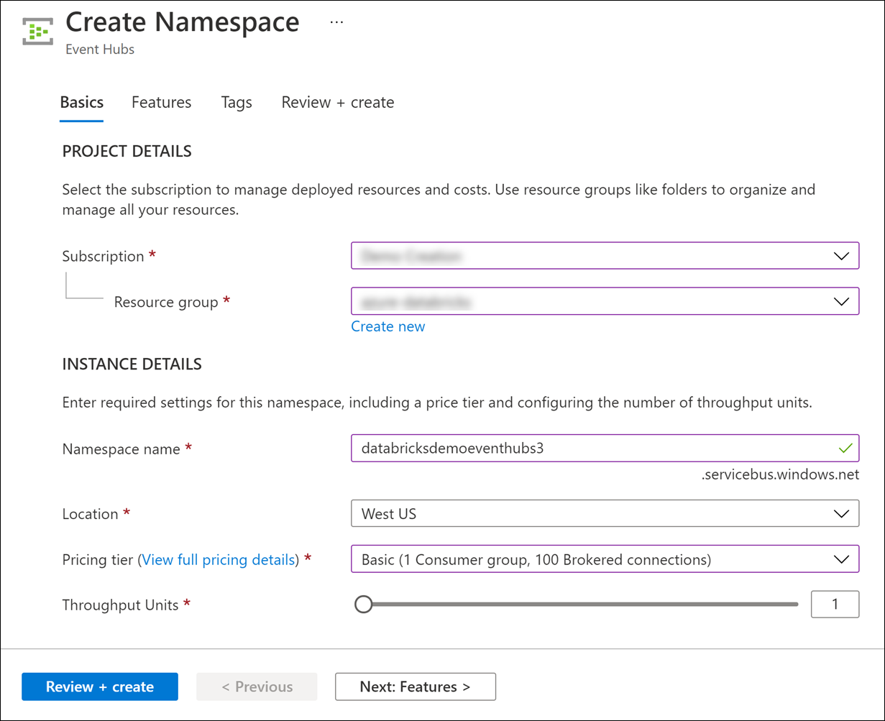
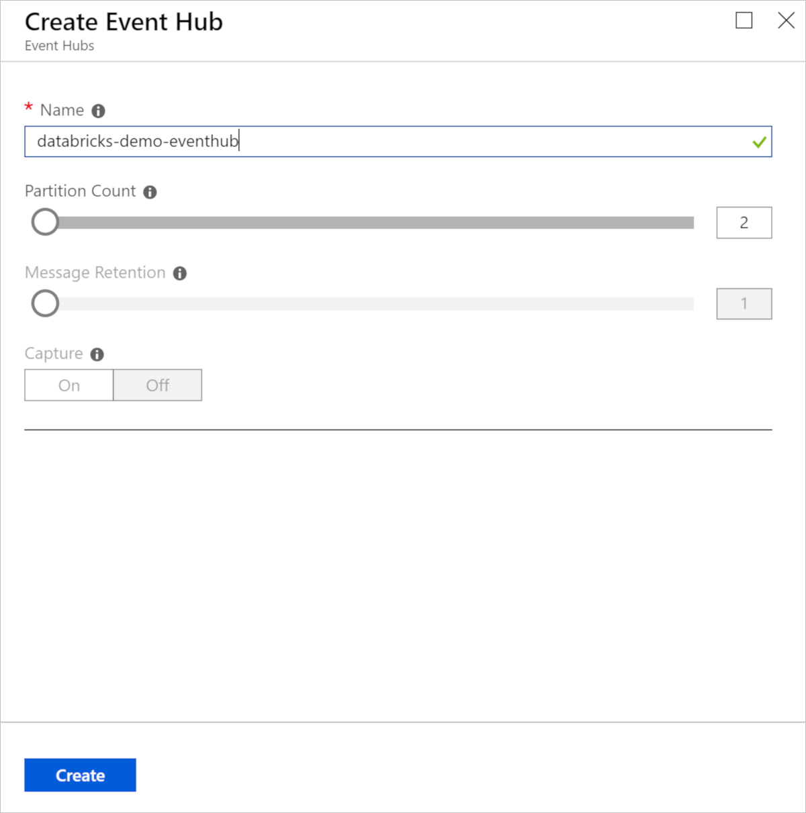
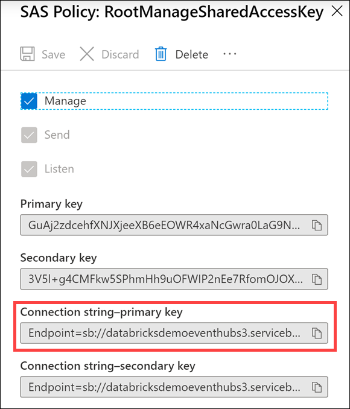

---
lab:
    title: 'Create a stream processing solution with Event Hubs and Azure Databricks'
    module: 'Module 11'
---

# Lab 11 - Create a stream processing solution with Event Hubs and Azure Databricks

In this lab, you will learn how to ingest and process streaming data at scale with Event Hubs and Spark Structured Streaming in Azure Databricks. You will learn the key features and uses of Structured Streaming. You will implement sliding windows to aggregate over chunks of data and apply watermarking to remove stale data. Finally, you will connect to Event Hubs to read and write streams.

After completing this lab, you will be able to:

- Know the key features and uses of Structured Streaming
- Stream data from a file and write it out to a distributed file system
- Use sliding windows to aggregate over chunks of data rather than all data
- Apply watermarking to remove stale data
- Connect to Event Hubs read and write streams

## Concepts

Apache Spark Structured Streaming is a fast, scalable, and fault-tolerant stream processing API. You can use it to perform analytics on your streaming data in near real time.

With Structured Streaming, you can use SQL queries to process streaming data in the same way that you would process static data. The API continuously increments and updates the final data.

## Event Hubs and Spark Structured Streaming

Azure Event Hubs is a scalable real-time data ingestion service that processes millions of data in a matter of seconds. It can receive large amounts of data from multiple sources and stream the prepared data to Azure Data Lake or Azure Blob storage.

Azure Event Hubs can be integrated with Spark Structured Streaming to perform processing of messages in near real time. You can query and analyze the processed data as it comes by using a Structured Streaming query and Spark SQL.

## Streaming concepts

Stream processing is where you continuously incorporate new data into Data Lake storage and compute results. The streaming data comes in faster than it can be consumed when using traditional batch-related processing techniques. A stream of data is treated as a table to which data is continuously appended. Examples of such data include bank card transactions, Internet of Things (IoT) device data, and video game play events.

A streaming system consists of:

- Input sources such as Kafka, Azure Event Hubs, IoT Hub, files on a distributed system, or TCP-IP sockets
- Stream processing using Structured Streaming, forEach sinks, memory sinks, etc.

## Lab setup and pre-requisites

Before starting this lab, ensure you have successfully completed the setup steps to create your lab environment.

### Exercise 0: Provision lab resources

To complete this lab, you will need to create an event hub.

#### Task 1: Create an Event Hubs namespace

1. In the [Azure portal](https://portal.azure.com), select **+ Create a resource**. Enter event hubs into the Search the Marketplace box, select Event Hubs from the results, and then select **Create**.

   

2. In the Create Namespace pane, enter the following information:

   - **Subscription**: Select the subscription group you're using for this module.
   - **Resource group**: Choose your module resource group.
   - **Namespace name**: Enter a unique name, such as **databricksdemoeventhubsxxx**, where xxx are your initials. Uniqueness will be indicated by a green check mark.
   - **Location**: Select the location you're using for this module.
   - **Pricing tier**: Select **Basic**.

1. Select **Review + create**, then select **Create**.

   

#### Task 2: Create an event hub

1. After your Event Hubs namespace is provisioned, browse to it and add a new event hub by selecting the **+ Event Hub** button on the toolbar.

   

2. On the **Create Event Hub** pane, enter:

   - **Name**: Enter `databricks-demo-eventhub`.
   - **Partition Count**: Enter **2**.

   Select **Create**.

   

#### Task 3: Copy the connection string primary key for the shared access policy

1. On the left-hand menu in your Event Hubs namespace, select **Shared access policies** under **Settings**, then select the **RootManageSharedAccessKey** policy.

   

2. Copy the connection string for the primary key by selecting the copy button.

   

3. Save the copied primary key to Notepad.exe or another text editor for later reference.

### Exercise 1: Complete the Structured Streaming Concepts notebook

#### Task 1: Clone the Databricks archive

1. If you do not currently have your Azure Databricks workspace open: in the Azure portal, navigate to your deployed Azure Databricks workspace and select **Launch Workspace**.
1. In the left pane, select **Compute**. If you have an existing cluster, ensure that it is running (start it if necessary). If you don't have an existing cluster, create a single-node cluster that uses the latest runtime and **Scala 2.12** or later.
1. When your cluster is running, in the left pane, select **Workspace** > **Users**, and select your username (the entry with the house icon).
1. In the pane that appears, select the arrow next to your name, and select **Import**.

    

1. In the **Import Notebooks** dialog box, select the URL and paste in the following URL:

 ```
   https://github.com/MicrosoftLearning/DP-203-Data-Engineer/raw/master/Allfiles/microsoft-learning-paths-databricks-notebooks/data-engineering/DBC/10-Structured-Streaming.dbc
 ```

1. Select **Import**.
1. Select the **10-Structured-Streaming** folder that appears.

#### Task 2: Complete the notebook

Open the **1.Structured-Streaming-Concepts** notebook. Make sure you attach your cluster to the notebook before following the instructions and running the cells within.

Within the notebook, you will:

- Stream data from a file and write it out to a distributed file system
- List active streams
- Stop active streams

After you've completed the notebook, return to this screen, and continue to the next step.

### Exercise 2: Complete the Working with Time Windows notebook

In your Azure Databricks workspace, open the **10-Structured-Streaming** folder that you imported within your user folder.

Open the **2.Time-Windows** notebook. Make sure you attach your cluster to the notebook before following the instructions and running the cells within.

Within the notebook, you will:

- Use sliding windows to aggregate over chunks of data rather than all data
- Apply watermarking to throw away stale old data that you do not have space to keep
- Plot live graphs using `display`

After you've completed the notebook, return to this screen, and continue to the next step.

### Exercise 3: Complete the Structured Streaming with Azure EventHubs notebook

In your Azure Databricks workspace, open the **10-Structured-Streaming** folder that you imported within your user folder.

Open the **3.Streaming-With-Event-Hubs-Demo** notebook. Make sure you attach your cluster to the notebook before following the instructions and running the cells within.

Within the notebook, you will:

- Connect to Event Hubs and write a stream to your event hub
- Read a stream from your event hub
- Define a schema for the JSON payload and parse the data to display it within a table

## Shut down your cluster

1. After you've completed the lab, in the left pane, select **Compute** and select your cluster. Then select **Terminate** to stop the cluster.
